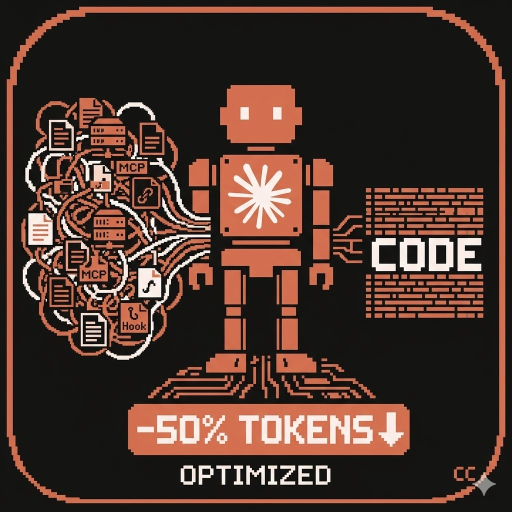

# context-optimizer

<p align="center">
  
</p>

<p align="center">
  <strong>Audit and optimize Claude Code context window usage</strong><br>
  Plugins, hooks, CLAUDE.md, MCP servers, env settings — scored report with auto-fix.
</p>

---

A Claude Code plugin that audits and optimizes your context window usage — plugins, hooks, CLAUDE.md, MCP servers, and environment settings.

Born from real-world optimization that achieved **50% token reduction** on a heavy agentic workflow (15 plugins, 30+ hooks, 4-layer CLAUDE.md cascade).

## What It Does

Runs a 9-phase audit:

1. **Cost Analysis** — Historical token spending via [ccusage](https://github.com/LEON-gittech/ccusage)
2. **Measure** — Count enabled plugins, hooks, CLAUDE.md tokens, MCP servers
3. **Audit Plugins** — Score each plugin by overhead (hooks, matchers, tech stack relevance)
4. **Audit Hooks** — Inventory all hooks across sources, detect duplicates and conflicts
5. **Audit CLAUDE.md** — Check cascade for duplication, bloat, wrong tech stack
6. **Audit MCP & Env** — Find unused servers, suggest env optimizations, detect connection churn
7. **Check .claudeignore** — Verify exclusion of irrelevant files
8. **Generate Report** — Scored report with before/after estimates
9. **Apply Fixes** — Direct edits with user approval

## New: Hidden Cost Detection (v2)

Recent updates detect previously invisible costs:

- **Zombie MCP processes**: Old claude sessions leave 300+ orphaned processes consuming 30+ GB RAM
- **alwaysThinkingEnabled**: Adds 30-50% latency to every response
- **PostToolUse hooks spawning sub-processes**: Invisible process and context cost per trigger
- **MCP connection churn**: Reconnection loops causing I/O bloat and CPU spikes
- **effortLevel overuse**: Using "high" for all tasks wastes 40% tokens

## Why This One

| Feature | context-optimizer | audit-setup | token-optimizer | context-optimization |
|---------|:-:|:-:|:-:|:-:|
| Plugin scoring | Y | - | - | - |
| Hook duplicate detection | Y | - | - | - |
| Per-tool-call overhead calc | Y | - | - | - |
| CLAUDE.md cascade dedup | Y | Y | - | - |
| MCP server audit | Y | - | - | - |
| .claudeignore check | Y | - | - | - |
| Env var optimization | Y | - | partial | - |
| Auto-fix (Edit tool) | Y | Y | - | - |
| Agentic workflow aware | Y | - | - | - |
| Zero dependencies | Y | Y | npm pkg | Y |

## Install

```bash
/plugin marketplace add LEON-gittech/claude-context-optimizer
/plugin install context-optimizer@LEON-gittech
```

Or manually:

```bash
cp skills/context-optimizer/SKILL.md ~/.claude/skills/context-optimizer/SKILL.md
```

## Usage

In any Claude Code session:

```
/context-optimizer
```

Or ask naturally: "optimize my context", "why are tokens so expensive", "audit my plugins"

## Real-World Results

Tested on a project with:
- 15 enabled plugins → optimized to 7
- 30+ hooks per event cycle → reduced to 18
- 8,425 token CLAUDE.md cascade → 4,570 tokens
- Startup overhead: ~35-50K → ~20-25K tokens (**50% reduction**)
- Per agentic iteration: **500K-1M tokens saved**

Additional optimization case (2026-04):
- 300+ zombie MCP processes → 0 (killed orphaned processes)
- Node process memory: 14.8 GB → 4.6 GB (**69% reduction**)
- `alwaysThinkingEnabled` disabled → 30-50% faster response
- PostToolUse sub-process spawn hook removed → fewer invisible processes per Skill call
- Unused MCP servers removed → fewer processes, less context bloat

## Companion: ccusage (forked with 14x speedup)

Use [ccusage](https://github.com/LEON-gittech/ccusage) to measure actual token spending before and after optimization:

```bash
npm install -g ccusage
ccusage --period day    # daily cost breakdown by model
ccusage --period week   # weekly trend
```

Our fork adds per-file caching for 14x faster analysis on large datasets.

## License

MIT
